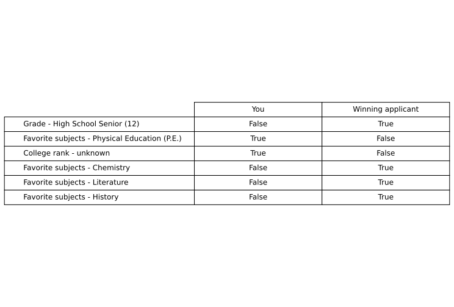
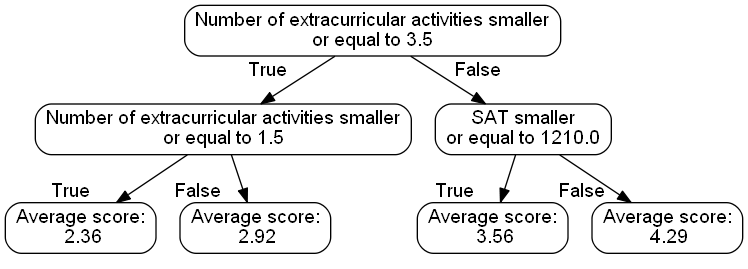

# Algorithmic Explanations (WIP)

> work in progress

This project generates explanations of the trained machine learning model. The following steps are included:
- cleaning of data and encoding of the features
- training and tuning a machine learning model (XGBoost)
- generating explanations from four machine learning explainability algorithms with a unified API
- generating different textual and visual explanations for the trained model

## Machine Learning explanability

Method				| Implemenation 				|Type | Scope | Option|
--- 				|	--- 						| --- | --- | --- | 
Permutation Feature Importance	|`PermutationExplanation.py`	| Non-contrastive | global |   sparse and dense |
Shapley Values		|	`ShapleyExplanation.py`		| Non-contrastive | local |   sparse and dense |
Global Surrogate Model|	`SurrogateModelExplanation.py`| Contrastive | global |  sparse and dense |
Counterfactual Example|	`CounterfactualExplanation.py`| Contrastive | local |  sparse and dense |

## Explanations

### Permutation Feature Importance

Method:
> To help you understand this decision, here are the six features which were most important for how the mechanism made its decision in your specific case:

Features:
> In your case, the six features which contributed most to the mechanism’s decision were the features 'Number of extracurricular activities' with an average contribution of 0.41, 
> 'Essay score' with an average contribution of 0.17, 'GPA' with an average contribution of 0.08, 'SAT' with an average contribution of 0.05, 'State of residence' with an average 
> contribution of 0.04 and 'Number of activities with leadership experience' with an average contribution of 0.03.

### Shapley Values

Method:

> To help you understand this decision, here are the six features which were most important for how the mechanism made its decision in your specific case:

Features:

> In your case, the six features which contributed most to the mechanism’s decision were the features 'Number of extracurricular activities' with an average contribution of 0.53, 
> 'Essay score' with an average contribution of -0.09, 'GPA' with an average contribution of 0.07, 'State of residence' with an average contribution of 0.06, 'SAT' with an average 
> contribution of -0.05 and 'College rank - unknown' with an average contribution of -0.04.

### Counterfactual Example

Method:

> To help you understand this decision, here is an example of another, similar applicant where the mechanism would have decided differently:

Features:

> In your case, the mechanism would have awarded you the scholarship, if your 'Grade' was High School Senior (12), if your 'Favorite subjects' was not 'Physical Education (P.E.)', 
> if your 'College rank' was not 'unknown', if your 'Favorite subjects' was Chemistry, if your 'Favorite subjects' was Literature and if your 'Favorite subjects' was History.

### Global Surrogate Model (Decision Tree)

Method:

> To help you understand this decision, here is a decision tree showing you how the mechanism made its decision:

Features:

> Applicants received an average score of 2.36 if the value of 'Number of extracurricular activities' is smaller or equal to 3.50 and > 'Number of extracurricular activities' is smaller or equal to 1.50.
> Applicants received an average score of 2.92 if the value of 'Number of extracurricular activities' is smaller or equal to 3.50 and > 'Number of extracurricular activities' is larger than 1.50.
> Applicants received an average score of 3.56 if the value of 'Number of extracurricular activities' is larger than 3.50 and 'SAT' is > smaller or equal to 1210.00.
> Applicants received an average score of 4.29 if the value of 'Number of extracurricular activities' is larger than 3.50 and 'SAT' is > larger than 1210.00.

## Authors
* **Mauro Luzzatto** - [Maurol](https://github.com/MauroLuzzatto)

