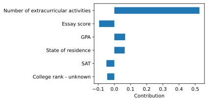
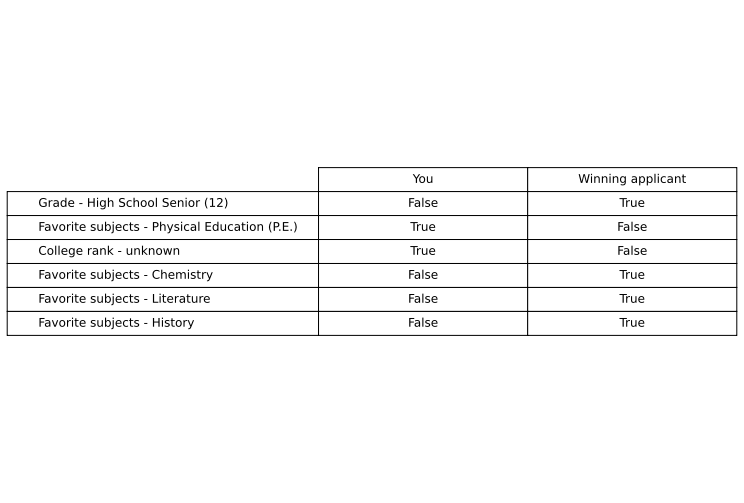

</a>
# explainy - model explanations for humans

explainy is a library for generating explanations for machine learning models in Python. It uses methods from **Machine Learning Explainability** and provides a standardized API to create feature importance explanations for samples. The explanations are generated in the form of plots and text.

explainy comes with four different to create either global or local, contrastive or non-contrastive and dense or sparse machine learning model explanations.

## Options
Setting		|	description	|
-----		|----			|
global		|			|
local		|			|
contrastive	|			|
non-contrastive	|			|
sparse		|			|
dense		|			|

<!--

# spaCy: Industrial-strength NLP

spaCy is a library for **advanced Natural Language Processing** in Python and
Cython. It's built on the very latest research, and was designed from day one to
be used in real products.

spaCy comes with
[pretrained pipelines](https://spacy.io/models) and
currently supports tokenization and training for **60+ languages**. It features
state-of-the-art speed and **neural network models** for tagging,
parsing, **named entity recognition**, **text classification** and more,
multi-task learning with pretrained **transformers** like BERT, as well as a
production-ready [**training system**](https://spacy.io/usage/training) and easy
model packaging, deployment and workflow management. spaCy is commercial
open-source software, released under the MIT license.

💫 **Version 3.0 out now!**
[Check out the release notes here.](https://github.com/explosion/spaCy/releases)

 

## 📖 Documentation

| Documentation              |                                                                |
| -------------------------- | -------------------------------------------------------------- |
| ⭐️ **[spaCy 101]**        | New to spaCy? Here's everything you need to know!              |
| 📚 **[Usage Guides]**      | How to use spaCy and its features.                             |
| 🚀 **[New in v3.0]**       | New features, backwards incompatibilities and migration guide. |
| 🪐 **[Project Templates]** | End-to-end workflows you can clone, modify and run.            |
| 🎛 **[API Reference]**      | The detailed reference for spaCy's API.                        |
| 📦 **[Models]**            | Download trained pipelines for spaCy.                          |
| 🌌 **[Universe]**          | Plugins, extensions, demos and books from the spaCy ecosystem. |
| 👩‍🏫 **[Online Course]**     | Learn spaCy in this free and interactive online course.        |
| 📺 **[Videos]**            | Our YouTube channel with video tutorials, talks and more.      |
| 🛠 **[Changelog]**          | Changes and version history.                                   |
| 💝 **[Contribute]**        | How to contribute to the spaCy project and code base.          |

[spacy 101]: https://spacy.io/usage/spacy-101
[new in v3.0]: https://spacy.io/usage/v3
[usage guides]: https://spacy.io/usage/
[api reference]: https://spacy.io/api/
[models]: https://spacy.io/models
[universe]: https://spacy.io/universe
[videos]: https://www.youtube.com/c/ExplosionAI
[online course]: https://course.spacy.io
[project templates]: https://github.com/explosion/projects
[changelog]: https://spacy.io/usage#changelog
[contribute]: https://github.com/explosion/spaCy/blob/master/CONTRIBUTING.md

--->

## Install explainy

## Overview

Method				| Implemenation 				|Type | Scope | Option|
--- 				|	--- 						| --- | --- | --- | 
Permutation Feature Importance	|`PermutationExplanation.py`	| Non-contrastive | global |   sparse and dense |
Shapley Values		|	`ShapleyExplanation.py`		| Non-contrastive | local |   sparse and dense |
Global Surrogate Model|	`SurrogateModelExplanation.py`| Contrastive | global |  sparse and dense |
Counterfactual Example|	`CounterfactualExplanation.py`| Contrastive | local |  sparse and dense |

## Explanations

### Permutation Feature Importance

Permutation feature importance measures the increase in the prediction error of the model after we permuted the feature's values, which breaks the relationship between the feature and the true outcome [1].

#### Characteristics
- global
- non-contrastive

#### Output

Method:
> To help you understand this decision, here are the six features which were most important for how the mechanism made its decision in your specific case:

Features:
> In your case, the six features which contributed most to the mechanism’s decision were the features 'Number of extracurricular activities' with an average contribution of 0.41, 
> 'Essay score' with an average contribution of 0.17, 'GPA' with an average contribution of 0.08, 'SAT' with an average contribution of 0.05, 'State of residence' with an average 
> contribution of 0.04 and 'Number of activities with leadership experience' with an average contribution of 0.03.

### Shapley Values
A prediction can be explained by assuming that each feature value of  the instance is a "player" in a game where the prediction is the payout.  Shapley values (a method from coalitional game theory) tells us how  to fairly distribute the "payout" among the features. The Shapley value is the average marginal contribution of a feature value across all possible coalitions [1].

#### Characteristics
- local
- non-contrastive

#### Output

Method:

> To help you understand this decision, here are the six features which were most important for how the mechanism made its decision in your specific case:

Features:

> In your case, the six features which contributed most to the mechanism’s decision were the features 'Number of extracurricular activities' with an average contribution of 0.53, 
> 'Essay score' with an average contribution of -0.09, 'GPA' with an average contribution of 0.07, 'State of residence' with an average contribution of 0.06, 'SAT' with an average 
> contribution of -0.05 and 'College rank - unknown' with an average contribution of -0.04.

### Counterfactual explanations
Counterfactual explanations tell us how the values of an instance have to change to significantly change its prediction. A counterfactual explanation of a prediction describes the smallest change to the feature values that changes the prediction to a predefined output. By creating counterfactual instances, we learn about how the model makes its predictions and can explain individual predictions [1].

#### Characteristics
- local
- contrastive

#### Output
Method:

> To help you understand this decision, here is an example of another, similar applicant where the mechanism would have decided differently:

Features:

> In your case, the mechanism would have awarded you the scholarship, if your 'Grade' was High School Senior (12), if your 'Favorite subjects' was not 'Physical Education (P.E.)', 
> if your 'College rank' was not 'unknown', if your 'Favorite subjects' was Chemistry, if your 'Favorite subjects' was Literature and if your 'Favorite subjects' was History.

### Global Surrogate Model (Decision Tree)
A global surrogate model is an interpretable model that is trained to approximate the predictions of a black box model. We can draw conclusions about the black box model by interpreting the surrogate model [1].

#### Characteristics
- global
- contrastive

#### Output

Method:

> To help you understand this decision, here is a decision tree showing you how the mechanism made its decision:

Features:

> Applicants received an average score of 2.36 if the value of 'Number of extracurricular activities' is smaller or equal to 3.50 and > 'Number of extracurricular activities' is smaller or equal to 1.50.
> Applicants received an average score of 2.92 if the value of 'Number of extracurricular activities' is smaller or equal to 3.50 and > 'Number of extracurricular activities' is larger than 1.50.
> Applicants received an average score of 3.56 if the value of 'Number of extracurricular activities' is larger than 3.50 and 'SAT' is > smaller or equal to 1210.00.
> Applicants received an average score of 4.29 if the value of 'Number of extracurricular activities' is larger than 3.50 and 'SAT' is > larger than 1210.00.

## Source

[1] Molnar, Christoph. "Interpretable machine learning. A Guide for Making Black Box Models Explainable", 2019. https://christophm.github.io/interpretable-ml-book/

## Authors
* **Mauro Luzzatto** - [Maurol](https://github.com/MauroLuzzatto)

