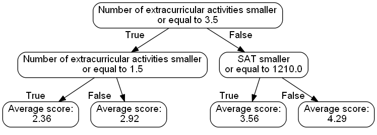

# explainy - Machine Learning explanations for humans

## Overview

Method				| Implemenation 				|Type | Scope | Option|
--- 				|	--- 						| --- | --- | --- | 
Permutation Feature Importance	|`PermutationExplanation.py`	| Non-contrastive | global |   sparse and dense |
Shapley Values		|	`ShapleyExplanation.py`		| Non-contrastive | local |   sparse and dense |
Global Surrogate Model|	`SurrogateModelExplanation.py`| Contrastive | global |  sparse and dense |
Counterfactual Example|	`CounterfactualExplanation.py`| Contrastive | local |  sparse and dense |

## Explanations

### Permutation Feature Importance

Permutation feature importance measures the increase in the prediction error of the model after we permuted the feature's values, which breaks the relationship between the feature and the true outcome [1].

#### Characteristics
- global
- non-contrastive

#### Output

Method:
> To help you understand this decision, here are the six features which were most important for how the mechanism made its decision in your specific case:

Features:
> In your case, the six features which contributed most to the mechanism’s decision were the features 'Number of extracurricular activities' with an average contribution of 0.41, 
> 'Essay score' with an average contribution of 0.17, 'GPA' with an average contribution of 0.08, 'SAT' with an average contribution of 0.05, 'State of residence' with an average 
> contribution of 0.04 and 'Number of activities with leadership experience' with an average contribution of 0.03.

### Shapley Values
A prediction can be explained by assuming that each feature value of  the instance is a "player" in a game where the prediction is the payout.  Shapley values (a method from coalitional game theory) tells us how  to fairly distribute the "payout" among the features. The Shapley value is the average marginal contribution of a feature value across all possible coalitions [1].

#### Characteristics
- local
- non-contrastive

#### Output

Method:

> To help you understand this decision, here are the six features which were most important for how the mechanism made its decision in your specific case:

Features:

> In your case, the six features which contributed most to the mechanism’s decision were the features 'Number of extracurricular activities' with an average contribution of 0.53, 
> 'Essay score' with an average contribution of -0.09, 'GPA' with an average contribution of 0.07, 'State of residence' with an average contribution of 0.06, 'SAT' with an average 
> contribution of -0.05 and 'College rank - unknown' with an average contribution of -0.04.

### Counterfactual explanations
Counterfactual explanations tell us how the values of an instance have to change to significantly change its prediction. A counterfactual explanation of a prediction describes the smallest change to the feature values that changes the prediction to a predefined output. By creating counterfactual instances, we learn about how the model makes its predictions and can explain individual predictions [1].

#### Characteristics
- local
- contrastive

#### Output
Method:

> To help you understand this decision, here is an example of another, similar applicant where the mechanism would have decided differently:

Features:

> In your case, the mechanism would have awarded you the scholarship, if your 'Grade' was High School Senior (12), if your 'Favorite subjects' was not 'Physical Education (P.E.)', 
> if your 'College rank' was not 'unknown', if your 'Favorite subjects' was Chemistry, if your 'Favorite subjects' was Literature and if your 'Favorite subjects' was History.

### Global Surrogate Model (Decision Tree)
A global surrogate model is an interpretable model that is trained to approximate the predictions of a black box model. We can draw conclusions about the black box model by interpreting the surrogate model [1].

#### Characteristics
- global
- contrastive

#### Output

Method:

> To help you understand this decision, here is a decision tree showing you how the mechanism made its decision:

Features:

> Applicants received an average score of 2.36 if the value of 'Number of extracurricular activities' is smaller or equal to 3.50 and > 'Number of extracurricular activities' is smaller or equal to 1.50.
> Applicants received an average score of 2.92 if the value of 'Number of extracurricular activities' is smaller or equal to 3.50 and > 'Number of extracurricular activities' is larger than 1.50.
> Applicants received an average score of 3.56 if the value of 'Number of extracurricular activities' is larger than 3.50 and 'SAT' is > smaller or equal to 1210.00.
> Applicants received an average score of 4.29 if the value of 'Number of extracurricular activities' is larger than 3.50 and 'SAT' is > larger than 1210.00.

## Source

[1] Molnar, Christoph. "Interpretable machine learning. A Guide for Making Black Box Models Explainable", 2019. https://christophm.github.io/interpretable-ml-book/

## Authors
* **Mauro Luzzatto** - [Maurol](https://github.com/MauroLuzzatto)

